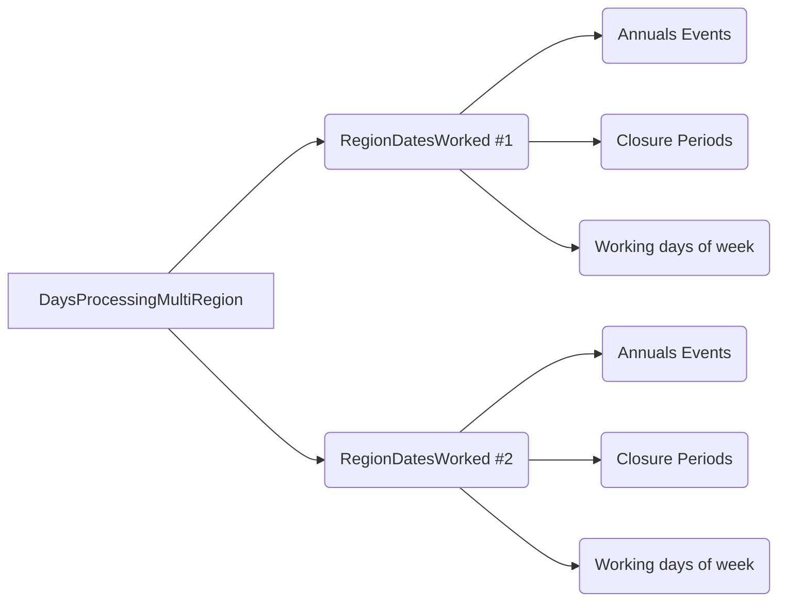
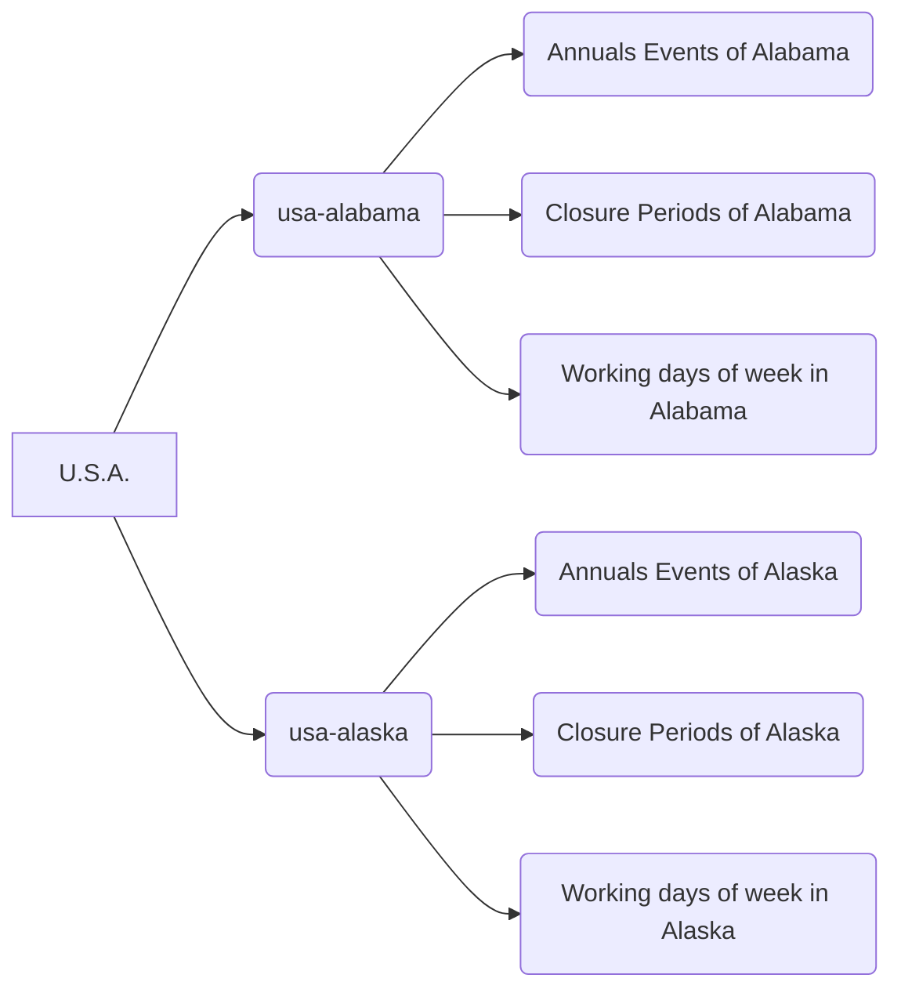

# pbDateComputation
Calculate holidays, closures, and working days with Xojo.

The repository is provided with an example project, allowing you to show how to calculate event dates and how to calculate working days, the next working day after a date, etc.

This is old Real Studio code updated to meet Xojo's API 2.0 requirements. There is still work to be done, particularly regarding documentation... Feel free to share your feedback.
# Table of contents

[Features and generalities](#features)<br>
&nbsp;&nbsp;&nbsp;&nbsp;[Object class diagram](#object-class-diagram)<br>
[Annual Event Classes](#the-4-classes-that-implement-the-annualevent-interface)<br>
&nbsp;&nbsp;&nbsp;&nbsp;[Common methods and properties](#cmap)<br>
&nbsp;&nbsp;&nbsp;&nbsp;&nbsp;&nbsp;&nbsp;&nbsp;[Common properties](#common-properties)<br>
&nbsp;&nbsp;&nbsp;&nbsp;&nbsp;&nbsp;&nbsp;&nbsp;[Common methods](#common-methods)<br>
&nbsp;&nbsp;&nbsp;&nbsp;[AnnualEventFix Class](#annualeventfix-class)<br>
&nbsp;&nbsp;&nbsp;&nbsp;[AnnualEventEaster & AnnualEventOrthodoxEaster Classes](#annualeventeaster-and-annualeventorthodoxeaster-classes)<br>
&nbsp;&nbsp;&nbsp;&nbsp;[AnnualEventWeekDay Class](#annualeventweekday-class)<br>
[ClosurePeriod Class](#closureperiod-class)<br>
[RegionDatesWorked Class](#regiondatesworked-class)<br>
&nbsp;&nbsp;&nbsp;&nbsp;[Properties](#dprproperties)<br>
&nbsp;&nbsp;&nbsp;&nbsp;[Methods](#dprmethods)<br>
# Features
<a id=generalities></a>
The features consist of 8 classes.
#### 4 classes for calculating annual events, such as holidays and commemorations
- AnnualEventFix;
- AnnualEventEaster and AnnualEventOrthodoxEaster;
- AnnualEventWeekDay

These 4 classes implement the **AnnualEvent** interface, allowing them to be used in the same array, for example.

#### A class to indicate periods of closure or holidays, for the class RegionDatesWorked

- ClosurePeriod

#### A class to calculate, for the same region, the working days, closed days, etc. according to holidays, closure periods and working days of the week.

- RegionDatesWorked

#### A class to work with multiple regions, which do not have the same public holidays or vacation periods, for example.

- DaysProcessingMultiRegion

### A class that is used to return the result of certain methods

- DateAndCaption

For example, you can request a list of all public holidays for a given year. An array of this type will be returned, specifying the date and name of the event for each row.

*A final class (dprWorkingWeekDays), which is only there to be a property of the RegionDatesWorked class, is also provided, but is not designed to be used on its own.*
### Object class diagram

This would give, for example, for the United States


[🔝 Back to Table of contents](#table-of-contents)

# The 4 classes that implement the AnnualEvent interface
 These classes are used to manipulate "annual events", such as holidays, celebrations, or events where calculating the date is a bit complicated (like "The Tuesday after the first Monday of November", for the U.S. Election Day).

| Class|For                       
|----------------|------------------------------- |
|AnnualEventFix  |for events whose date is calculated using a fixed month and day (Independence Day, Christmas, etc.)          |
|AnnualEventEaster |for events whose date is calculated based on Easter (Mardi Gras, Ash Wednesday, etc.)                      |
|AnnualEventOrthodoxEaster         |for events whose date is calculated based on Orthodox Easter 
|AnnualEventWeekDay|for events whose date is calculated based on a fixed month and the week number of a weekday (Labor Day, Thanksgiving, etc.) 

<a id="cmap"></a>
### Common methods and properties (implemented by the interface)
Note: An interface defines only methods and not properties. "Properties" are a pair of overloaded methods that simulate real properties.

    Public Sub Caption(assigns s as string) 
    Public Function Caption() As string

#### Common properties
##### Caption 
Type : String

Defines the caption of the event, for example Christmas, Easter, presidential election, etc.
##### DayOff 
Type : Boolean

Defines if it is a non-working day or not (for non-working day the value is true)

The default value is True.

##### StartOfValidity, EndOfValidity
Type : DateTime

Defines the dates on which the event occurs. For example, we can imagine a new public holiday being created starting next year (or an existing public holiday being discontinued).

The default dates are from January 1st of year 1 to December 31st of year 3999.
##### CycleFirstYear, CycleYearDuration
Type : Integer

An event may not occur every year. For example, an election.

If this is the case, you must define the first year and the cycle duration.

**Note :** that if the CycleYearDuration property is less than 2, these parameters are ignored.

The default values ​​are 1900 for CycleFirstYear and 1 for CycleYearDuration.

For example, the cycle for the US presidential election can be defined as follows: 

    Var PresidentialElection As New AnnualEventWeekDay("U.S. Presidential Election",11,2,1) // The first monday of november
    PresidentialElection.NextWeekDay = 3 // Shift to the next tuesday (so the next tuesday after the first monday)
    PresidentialElection.CycleFirstYear = 1792  // The event is not every year
    PresidentialElection.CycleYearDuration = 4

##### Tag
Type : Variant

Variable to put whatever you need in it

[:top: Back to Table of contents](#table-of-contents)
#### Common methods

##### DateValue(Year as integer) as DateTime
Returns the date of the event for the specified year.

If the event did not occur that year, Nil is returned.
The reasons for a Nil value could be that the year falls outside the event's validity period or that the year does not correspond to the cycle.
Hours, minutes, and seconds are all set to 0.

    Var GoodFriday As New AnnualEventEaster("Good Friday",-2)
     // Determine the date for the year 2025
    Var Value2025 as Datetime = GoodFriday.DateValue(2025)
##### Calculate(Year as integer) as DateAndCaption
Returns a DateAndCaption object for the event for the specified year.
The object's date property contains the event date, and the Caption property replicates the event's Caption property.

If the event did not occur that year, Nil is returned.
The reasons for a Nil value could be that the year falls outside the event's validity period or that the year does not correspond to the cycle.
Hours, minutes, and seconds of the Date propertie of the object are all set to 0.

##### TestDate(d as DateTime) as Boolean
Determines if the event occurs on the tested date.
Hours, minutes, and seconds are ignored.

     Var GoodFriday As New AnnualEventEaster("Good Friday",-2)
     Var t as new DateTime(2025,4,18)
     if GoodFriday.TestDate(t) then 
        MessageBox "It's the date of the Good Friday !"
     else
       MessageBox "It's NOT the date of the Good Friday !"
     end
##### DbRow(RegionIdentifier as Variant = Nil, encoding as TextEncoding = nil) as DatabaseRow
Returns a DatabaseRow object.
This allows you to quickly save an event definition to a database.
Example :

    Var LaborDayEvent as New AnnualEventWeekDay("Labor Day",9, 2, 1) // September, the first monday
    Call MyDatabase.AddRow "tdays", LaborDayEvent.dbrow

You can specify the RegionIdentifer for the event if you are working with multiple regions. For example, the date of the commemoration of the abolition of slavery is not the same in the different French regions concerned. This allows you to filter them in the database.

You can also specify a specific encoding, particularly for databases that do not support UTF-8. By default, it is UTF-8.

Below is the SQL (SQLite) code to create a table to store event definitions.
The RegionDatesWorked class provides a method to load events from a RowSet.

    CREATE TABLE "tdays" (
	"id_date"	INTEGER NOT NULL,
	"start"	DATE NOT NULL DEFAULT '1-1-1',
	"end"	DATE NOT NULL DEFAULT '3999-12-31',
	"caption"	TEXT,
	"region"	TEXT,
	"definitiontype"	TEXT NOT NULL,
	"dayoff"	BOOLEAN NOT NULL DEFAULT 1,
	"cyclefirstyear"	INTEGER NOT NULL DEFAULT 1,
	"cycleyearduration"	INTEGER NOT NULL DEFAULT 1,
	"month"	INTEGER NOT NULL DEFAULT 0,
	"day"	INTEGER NOT NULL DEFAULT 0,
	"weekday"	INTEGER NOT NULL DEFAULT 0,
	"rank"	INTEGER NOT NULL DEFAULT 0,
	"adddays"	INTEGER NOT NULL DEFAULT 0,
	"nextweekday"	INTEGER NOT NULL DEFAULT 0,
	"previousweekday"	INTEGER NOT NULL DEFAULT 0,
	"saturdaytofriday"	BOOLEAN NOT NULL DEFAULT 0,
	"sundaytomonday"	BOOLEAN NOT NULL DEFAULT 0,
	"saturdaytomonday"	BOOLEAN NOT NULL DEFAULT 0,
	"fingerprint"	TEXT NOT NULL,
	"alwaysdayshift"	BOOLEAN NOT NULL DEFAULT 0,
	PRIMARY KEY("id_date" AUTOINCREMENT)
	);
#### FingerPrint() as string
Returns a value calculated based on the nature of the event, its parameters, and its validity dates. 
The caption and the shift parameters properties is not part of the fingerprint.

    Var VictoriaDay As New AnnualEventFix("Victoria Day ou Fête des patriotes",5,25) // May, 25th
    VictoriaDay.AlwaysPreviousWeekDay = 2 // Previous Monday, even if the calculation falls on a Monday
    MessageBox dFixedDay.FingerPrint

This code return "F05;25;0|0001-01-01|3999-12-31"
#### DefinitionObject() as variant
Returns the object as a variant

Example :
Events() is a array of AnnualEvent

		Var dFix as AnnualEventFix 
		Var dEaster as AnnualEventEaster
		Var dEasterOrthodox as AnnualEventOrthodoxEaster
		Var dWeekDay as AnnualEventWeekDay
    For i as integer = 0 to Events.LastIndex
    
    	Select Case Events(i)
    	
    	Case IsA AnnualEventFix 
      
    			dFix = Events(i).DefinitionObject
      
    	Case IsA AnnualEventEaster
    	  
    	   dEaster = Events(i).DefinitionObject
      
    	Case IsA AnnualEventOrthodoxEaster
          
		   dEasterOrthodox = Events(i).DefinitionObject
     
       Case IsA AnnualEventWeekDay
     
	      dWeekDay =  Events(i).DefinitionObject
      
    End  Select
    
    Next i

[🔝 Back to Table of contents](#table-of-contents)
### AnnualEventFix Class
In addition to the methods and properties common to the interface, here are the properties specific to this class.
#### Methods
##### Constructor(lCaption as string = "", lMonth as Integer = 1, lDay as Integer = 1, lFridayIfSaturday as Boolean = False, lMondayIfSunday as Boolean = False)
Creates a new object AnnualEventFix  whose properties are defined in the method arguments.

    Var dFixedDay As New AnnualEventFix("Día de la Independencia",9,16) // Mexico

##### Constructor(copy as AnnualEventFix)
Creates a new object AnnualEventFix whose properties are the same as the **copy** object passed (duplication).

    Var dFixedDay As New AnnualEventFix("Día de la Independencia",9,16) // Mexico
    Var dDupli as New AnnualEventFix(dFixedDay)

##### Constructor(a as AnnualEvent)
Creates a new object AnnualEventFix whose properties are the same as the **copy** object passed (duplication).
If the AnnualEvent is not a AnnualEventFix then a InvalidArgumentException is raised.

#### Properties 
##### Month, Day
Type : Integer

These two values ​​define the month and day of the event each year.

    Var dFix as AnnualEventFix
    // Bastille Day
    dFix.month = 7
    dFix.day = 14

##### MondayIfSunday
Type : Boolean

Determines whether the event should be postponed to Monday if it takes place on a Sunday.

    Var dFix as AnnualEventFix
    // Independence day
    dFix.month = 7
    dFix.day = 4
    dFix.MondayIfSunday = True

***Note :*** The property can be associated with FridayIfSaturday


##### FridayIfSaturday
Type : Boolean

Determines whether the event should be moved to the previous Friday if it takes place on a Saturday.

    Var dFix as AnnualEventFix
    // Independence day
    dFix.month = 7
    dFix.day = 4
    dFix.FridayIfSaturday = True

***Note :***  The property can be associated with MondayIfSunday

    Var dFix as AnnualEventFix
    // Independence day
    dFix.month = 7
    dFix.day = 4
    // Never a weekend :-)
    dFix.FridayIfSaturday = True
    dFix.MondayIfSunday = True
##### NextWeekDay, PreviousWeekDay, AlwaysNextWeekDay, AlwaysPreviousWeekDay
Type : Integer

Determines whether the day will be shifted to the corresponding day of the following week day (or the previous one)

Use NextWeekDay/PreviousWeekDat if shifting is only necessary if the calculation does not fall on the requested day of the week.

Use AlwaysNextWeekDay/AlwaysPreviousWeekDay if shifting is ALWAYS necessary, even if the calculation falls on the correct day of the week (in this case, it's a one-week shift).
For example, in Canada, Victoria Day is ALWAYS shifted to the Monday before May 25th, even if May 25th is a Monday (This is the case for 2026).

The value is the same as the DayOfWeek property of the DateTime class. 
The value less that 1 indicates that there will be no offset
 
    // Victoria Day ou Fête des patriotes
    Var dFixedDay As New AnnualEventFix
    dFixedDay.Month = 5
    dFixedDay.Day = 25
    dFixedDay.AlwaysPreviousWeekDay = 2
##### AddDays
Type : Integer

Shifts the event by the specified number of days. Accepts negative values.
The value less that 0 indicates that there will be no offset

For example, imagine a holiday that falls on the day after February 28th.

    // Fun fact: there is a one in 1506 chance of being born on February 29th.
    Var dFixedDay As New AnnualEventFix
    dFixedDay.Caption = "The birthday of people born on February 29th"
    dFixedDay.Month = 2
    dFixedDay.Day = 28
    dFixedDay.AddDays = 1
The calculation will give March 1st except for leap years where it will give February 29th.

#### :warning: Important note on the combination and order of the shifts
The calculation function will first consider the MondayIfSunday and FridayIfSaturday properties, which are cumulative. If these properties are used, it will stop there and ignore any other offsets.
Otherwise, it will apply only ONE of the following conditions in the order below:

 1. AlwaysPreviousWeekDay 
 2. AlwaysNextWeekDay 
 3. PreviousWeekDay
 4. NextWeekDay
 5. AddDays

[🔝 Back to Table of contents](#table-of-contents)
### AnnualEventEaster and AnnualEventOrthodoxEaster Classes
In addition to the methods and properties common to the interface, here is one property specific to this class.
The only difference between the AnnualEventOrthodoxEaster class and the AnnualEventEaster class is the algorithm.

Note that the date calculated by AnnualEventOrthodoxEaster is the date of the event in the Gregorian calendar.

#### Methods
##### Constructor(lCaption as string = "", lDeltaEaster as Integer = 0)
  Creates a new object AnnualEventEaster (or AnnualEventOrthodoxEaster) whose properties are defined in the method arguments.

```
Var dEasterDay As New AnnualEventEaster("Palm Sunday",-7)
```

##### Constructor(copy as AnnualEventEaster )

Creates a new object AnnualEventEaster whose properties are the same as the **copy** object passed (duplication).

```
Var dEasterDay As New AnnualEventEaster("Palm Sunday",-7)
Var dDupli as New AnnualEventEaster(dEasterDay )
```
##### Constructor(a as AnnualEvent)

Creates a new object AnnualEventEaster whose properties are the same as the "a" object passed (duplication).  
If the AnnualEvent is not a AnnualEventEaster then a InvalidArgumentException is raised.

#### Properties 
##### DeltaEster
Type : Integer

The number of days to add or subtract from the date of Easter to calculate the date. If 0, it is Easter Sunday.

#### Constants
A number of constants are included with this class.

For example, AnnualEventEaster.AshWednesday equals -46.
Since some holidays have multiple names, you may have several constants with the same value.

**Note :** Despite multiple checks, errors may still exist in the values ​​or names.

[🔝 Back to Table of contents](#table-of-contents)
### AnnualEventWeekDay Class
In addition to the methods and properties common to the interface, here are properties specific to this class.
#### Methods
##### Constructor(lCaption as string = "", lMonth as Integer = 1, lWeekDay as Integer = 1, lRank as Integer = 1)
 Creates a new object AnnualEventWeekDay whose properties are defined in the method arguments.

```
Var dWeekDay As New AnnualEventWeekDay("Thanksgiving Day",11,5,4)
// "Thanksgiving Day" => Caption
// November (11) => Month
// Thursday (5) => WeekDay
// The 4th (4) => Rank
```
##### Constructor(copy as AnnualEventWeekDay )

Creates a new object AnnualEventWeekDay whose properties are the same as the **copy** object passed (duplication).

```
Var dWeekDay As New AnnualEventWeekDay("Thanksgiving Day ",11,5,4)
Var dDupli as New AnnualEventWeekDay(dWeekDay)
```
##### Constructor(a as AnnualEvent)

Creates a new object AnnualEventWeekDay whose properties are the same as the "a" object passed (duplication).  
If the AnnualEvent is not a AnnualEventWeekDay then a InvalidArgumentException is raised.
#### Properties 
##### Month, WeekDay, Rank
Type : Integer

Use these three properties to define the event date.

For the third Thursday of February, for example, the values ​​are:

    dWeekDay.Month = 2 // February
    dWeekDay.WeekDay = 5 // Thursday
    dWeekDay.Rank = 3 // 3rd week

To indicate the last week (without knowing if it will be the 4th or 5th), use Rank = 6
##### NextWeekDay, PreviousWeekDay
Type : Integer

Determines whether the day will be shifted to the corresponding day of the following week (or the previous one)

Use NextWeekDay/PreviousWeekDay if shifting is only necessary if the calculation does not fall on the requested day of the week.
The value is the same as the DayOfWeek property of the DateTime class. 
The value less that 1 indicates that there will be no offset

    // U.S. Presidential Election (First example of calculation)
    Var dWeekDay As New AnnualEventWeekDay("Presidential Election",11,2,1) // First Monday of November
    dWeekDay.NextWeekDay = 3 // The Tuesday following the first Monday in November 
    dWeekDay.CycleFirstYear = 1848  // The event is not every year
    dWeekDay.CycleYearDuration = 4

##### AddDays
Type : Integer

Shifts the event by the specified number of days. Accepts negative values.
The value less that 0 indicates that there will be no offset


    // U.S. Presidential Election (Second example of calculation)
    Var dWeekDay As New AnnualEventWeekDay("Presidential Election",11,2,1) // First Monday of November
    dWeekDay.AddDays = 1 // The day following the first Monday in November (so a Tuesday)
    dWeekDay.CycleFirstYear = 1848  // The event is not every year
    dWeekDay.CycleYearDuration = 4


#### :warning: Important note on the combination and order of the shifts
The algorithm will apply only ONE of the following conditions in the order below:
 1. PreviousWeekDay  
 2. NextWeekDay
 3.  AddDays

[🔝 Back to Table of contents]#table-of-contents)
## ClosurePeriod Class
This class is used to define closure or vacation periods.

Its main purpose is to add it to the ClosurePeriods array of a RegionDatesWorked class.
#### Methods
##### Constructor(lFirstDay as DateTime = Nil, lLastDay as DateTime = Nil, lCaption as string = "")
Creates a new object ClosurePeriods whose properties are defined in the method arguments.

    Var SummerHolidays as new  ClosurePeriod(New DateTime(2025, 6,8), New DateTime(2025, 8,31), "Summer Break")
##### Duration as integer
Returns the duration in days of the period
##### IsIncluded(lDate as DateTime) as Boolean
Returns True if the Date is included in the period.

    Var SummerHolidays as new  ClosurePeriod(New DateTime(2025, 6,8), New DateTime(2025, 8,31), "Summer Break")
    Var dTest as new DateTime(2025,8,1)
    if SummerHolidays.IsIncluded(dtTest) then
	    MessageBox "It's during the holidays!"
    else
	    MessageBox "It's not during the holidays"
    end

#### Properties
##### Caption
Type : string

Defines the caption of the period.
##### FirstDay, LastDay
Type : DateTime

These define the first and last days of the period.

Note that when you assign these values, the first day is automatically set to 00:00:00 and the last day to 23:59:59.

[🔝 Back to Table of contents](#table-of-contents)
## RegionDatesWorked Class

This class allows you to manage closure periods, non-working events, and working or non-working days of the week.
By combining these three elements, it helps you calculate the list of working days, the list of non-working days, the next working day, etc.
The class has four properties for this:

 -  An array of the class AnnualEvent
 -  An array of the class ClosurePeriod
 -  A WorkingWeekDays object, which allows you to specify which days of the week are worked
 - A RegionIdentifier property (type variant), to distinguish the object (for example "usa-florida"), if you are    working with multiple regions.
<a id=dprproperties></a>
#### Properties
##### Identifier
Type : Variant
Allows you to give an identification to your region, for example the name of a state, a region, the number of a prefecture, etc.

##### AnnualEvents()

Type : AnnualEvent

This array contains all the annual events in the region.
For example, for the District of Columbia :

    Var r as new RegionDatesWorked("DC")
    
    // https://edpm.dc.gov/chapter/12/#section-1220
    
    Var df as New AnnualEventFix("Inauguration Day", 1, 20, False, True)
    df.CycleFirstYear = 1849
    df.CycleYearDuration = 4
    r.AnnualEvents.Add df
    
    r.AnnualEvents.Add New AnnualEventFix("New Year's Day", 1, 1,  True, True) // January, 1st
    r.AnnualEvents.Add New AnnualEventFix("Independence Day", 7,4,  True, True) // July, 4
    r.AnnualEvents.Add New AnnualEventFix("Veterans Day", 11,11,  True, True) // November, 11
    r.AnnualEvents.Add New AnnualEventFix("Christmas",12,25,  True, True) // December, 25
    r.AnnualEvents.Add New AnnualEventWeekDay("Birthday of Martin Luther King, Jr.", 1,2,3) // January, Monday, The Third
    r.AnnualEvents.Add New AnnualEventWeekDay("Washington's Birthday", 2,2,3) // Frebruary, Monday, The Third
    r.AnnualEvents.Add New AnnualEventWeekDay("Memorial Day", 5, 2, 6) // May, the last monday
    r.AnnualEvents.Add New AnnualEventWeekDay("Labor Day",9, 2, 1) // September, the first monday
    r.AnnualEvents.Add New AnnualEventWeekDay("Columbus Day",10, 2, 2) // October, the second monday
    r.AnnualEvents.Add New AnnualEventWeekDay("Thanksgiving",11, 5, 4) // November, the 4th thursday
Another example, for the Wallonie, region of Belgium    

    Var r as new RegionDatesWorked("belgium-wallonie")
    r.AnnualEvents.Add New AnnualEventFix("Premier janvier", 1, 1)
    r.AnnualEvents.Add New AnnualEventFix("Fête du travail", 5, 1)
    r.AnnualEvents.Add New AnnualEventFix("Fête Nationale", 7, 21)
    r.AnnualEvents.Add New AnnualEventFix("Assomption", 8, 15)
        
    r.AnnualEvents.Add New AnnualEventFix("Toussaint", 11, 1)
    r.AnnualEvents.Add New AnnualEventFix("Armistice 1918", 11, 11)
    r.AnnualEvents.Add New AnnualEventFix("Noël", 12, 25)
        
    r.AnnualEvents.Add New AnnualEventEaster("Lundi de Pâques", 1)
    r.AnnualEvents.Add New AnnualEventEaster("Ascension", 39)
    r.AnnualEvents.Add New AnnualEventEaster("Lundi de Pentecôte", 50)
   
    // If you work for a public service
    r.AnnualEvents.Add New AnnualEventFix("Fête de la Fédération Wallonie-Bruxelles", 9,27)
    r.AnnualEvents.Add New AnnualEventFix("Fête des morts", 11, 2)
    r.AnnualEvents.Add New AnnualEventFix("Jour de la Dynastie", 11, 15)
    r.AnnualEvents.Add New AnnualEventFix("Deuxième jour de Noël", 12, 26)
##### ClosurePeriods()
Type : ClosurePeriod

This array contains all the ClosurePeriod objects for the region.

For example, for school holidays in the District of Columbia (if your business is related to the school system).

    Var r as new RegionDatesWorked("DC")
    // https://washingtonparent.com/dc-public-school-calendar-2025-2026/
    
    r.ClosurePeriods.Add New ClosurePeriod(New DateTime(2025,11,26), New DateTime(2025,11,30), "Thanksiving Break")
    r.ClosurePeriods.Add New ClosurePeriod(New DateTime(2025,12,20), New DateTime(2026,1,4), "Winter Break")
    r.ClosurePeriods.Add New ClosurePeriod(New DateTime(2026,4,11), New DateTime(2026,4,19), "Spring Break")
    r.ClosurePeriods.Add New ClosurePeriod(New DateTime(2026,6,18), New DateTime(2026,8,16), "Summer Break") // Not sure for the 8/16/2026
##### WorkingWeekDays()
Type : dprWorkingWeekDays

Use this property to define the days of the week that are usually worked.
By default, only Saturday and Sunday are non-working days.

    Var r as new RegionDatesWorked("DC")
    r.WorkingWeekDays.WorkingSaturday = True // In my business, we works Saturday
    // The same setting, but indicating the day number of the week, to be used in a For...Next loop for example.
    r.WorkingWeekDays.WorkingDay(7) = True // In my business, we works Saturday

##### Tag
Type : Variant

Variable to put whatever you need in it.

[🔝 Back to Table of contents](#table-of-contents)

<a id=dprmethods></a>
#### Methods
##### Constructor (lIdentifier as variant)
Create a new object RegionDatesWorked and assign the Identifier property

    Var r as new RegionDatesWorked("DC")

##### Constructor (copy as RegionDatesWorked, NewIdentifier as Variant = Nil)
Create a new object RegionDatesWorked whose properties are the same as the **copy** object passed (duplication), and assign the Identifier property

    Var rDC as new RegionDatesWorked("DC")
    Var MySchool as new RegionDatesWorked(rDC, "My Fabulous School")
##### BusinnesDays(starting as DateTime, ending as DateTime) as DateTime()
##### BusinnesDays(Year as integer) as DateTime()
Returns an array of DateTime objects, corresponding to each open day, based on the specified working days of the week, closure periods, and public holidays.
The calculation is performed either between two dates or over a year.
All dates are set to 00:00:00
##### ClosurePeriodMatch(d as DateTime) as Boolean
Returns True if the date is included in at least one closure period.
##### ClosurePeriodMatchCaption(d as DateTime) as Boolean
Returns the caption of the period, if the date is included in at least one closure period (return the caption of the first period found in the array).
##### ClosurePeriodMatchObject(d as DateTime) as ClosurePeriod
Returns ClosurePeriod object, if the date is included in at least one closure period (return the first period found in the array).
##### CountBusinessDays(Date1 as datetime, Date2 as datetime) as integer
Returns the number of working days corresponding to each opening day, based on the specified weekdays, closure periods, and public holidays.
If Date1 and Date2 are on the same day and the date is a working day, then 1 will be returned, otherwise 0.
##### CountNonWorkingDays(Date1 as datetime, Date2 as datetime) as integer
Returns the number of non-working days corresponding to each day off, based on the specified weekdays, closure periods, and public holidays.
If Date1 and Date2 are on the same day and the date is a non-working day, then 1 will be returned, otherwise 0.
##### AnnualEventMatch(d as DateTime, OnlyIfDayOff as Boolean = False)  as boolean
##### AnnualEventMatchObject(d as DateTime, OnlyIfDayOff as Boolean = False)  as AnnualEvent
##### AnnualEventMatchDateAndCaption(d as DateTime, OnlyIfDayOff as Boolean = False) as DateAndCaption
##### AnnualEventMatchCaption(d as DateTime, OnlyIfDayOff as Boolean = False) as String
##### AnnualEventMatchRegion(d as DateTime, OnlyIfDayOff as Boolean = False) as Variant

The methods test if d is a day of an event.
If True:

 - AnnualEventMatch returns True. If no match is found, it returns False.
 - AnnualEventMatchObject returns a AnnualEvent object interface.  If no match is found, it returns Nil.  
 - AnnualEventMatchDateAndCaption returns a DateAndCaption object that contains the date, the event caption, and the region identifier. If no match is found, it returns Nil.   
- AnnualEventMatchCaption returns a string contains the caption of annual event. If no match is found, it returns a empty string.
-  AnnualEventMatchRegion returns the region Identifier (this is used when looping through multiple regions to determine which region has a public holiday). If no match is found, it returns Nil.

In this example, r is a RegionDatesWorked object, for the District of Columbia (see above for the code to add holidays)

    Var dTest as New DateTime(2024,11,11) 
    Var AE as AnnualEvent = r.AnnualEventMatchObject(dTest)
    If AE <> Nil then
        	Select Case AE
    	
    	Case IsA AnnualEventFix 
      
    			MessageBox "Event Fix : " + AE.Caption
      
    	Case IsA AnnualEventEaster
    	  
    	   MessageBox "Event based on Easter : " + AE.Caption
      
    	Case IsA AnnualEventOrthodoxEaster
          
		   MessageBox "Event based on Orthodox Easter : " + AE.Caption
     
       Case IsA AnnualEventWeekDay
     
	      MessageBox "Event based on weekday and then week number : " + AE.Caption
          End  Select
    
    End If 
##### IsWorkingDay(d as DateTime) as Boolean
Returns True if the date is a working day, depending on the specified working days, closing periods and public holidays.

In this example, r is a RegionDatesWorked object, for the District of Columbia (see above for the code to add holidays)

    Var d as DateTime = DateTime.Now()
    if r.IsWorkingDay(d) then MessageBox "Today, it's a working day !"

##### ListOfAnnualEvents(Starting as DateTime, Ending as DateTime, OnlyDayOff as boolean = False, IncludeSaturday as Boolean = True, IncludeSunday as Boolean = True, IncludeMonday as Boolean = True, IncludeTuesday as Boolean = True, IncludeWednesday as Boolean = True, IncludeThursday as Boolean = True, IncludeFriday as Boolean = True) as DateAndCaption
##### ListOfAnnualEvents(Year as integer, OnlyDayOff as boolean = False, IncludeSaturday as Boolean = True, IncludeSunday as Boolean = True, IncludeMonday as Boolean = True, IncludeTuesday as Boolean = True, IncludeWednesday as Boolean = True, IncludeThursday as Boolean = True, IncludeFriday as Boolean = True) as DateAndCaption
Returns an array of DateAndCaption objects, listing all events between the two dates (or over the chosen year).

You can filter to show only events that are holidays (OnlyDayOff = True). By default, OnlyDayOff = False.

You can also choose whether or not to include events that take place on a specific day of the week in the results. By default, all days of the week are included.

In this example, r is a RegionDatesWorked object, for the District of Columbia (see above for the code to add holidays)

    //  All events for 2025, only holydays (non working event) and unless they fall on Sunday
    Var Holidays() as DateAndCaption = r.ListOfAnnualEvents(2025, True, True, False)
##### NextBusinessDay(d as datetime, number as integer = 1) as DateTime
##### PreviousBusinessDay(d as datetime, number as integer = 1) as DateTime
Returns the next open day (1), or the second (2), ... depending on the parameter number. The function takes into account working days of the week, closing periods, and events.
AnnualEvents with the DayOff property = True are non-working days.
Negative values ​​give the same result as the PreviousBusinessDay function. Similarly, negative values ​​for the PreviousBusinessDay function give the same result as for the NextBusinessDay function.

In this example, r is a RegionDatesWorked object, for the District of Columbia (see above for the code to add holidays)

    Var d as DateTime = DateTime.Now()
    Var DeliveryDay = r.NextBusinessDay(4) // Four business days for a delivery

##### NextNonWorkingDay(d as datetime, number as integer = 1) as DateTime
##### PreviousNonWorkingDay(d as datetime, number as integer = 1) as DateTime
Returns the next non-working day (1), or the second (2), ... depending on the parameter number. The function takes into account working days of the week, closure periods, and events.
AnnualEvents with the DayOff property = True are non-working days.
Negative values ​​give the same result as the PreviousNonWorkingDay function. Similarly, negative values ​​for the PreviousNonWorkingDay function give the same result as for the NextNonWorkingDay function.

##### NonWorkingDayReasonCaption(d as DateTime) as string
##### NonWorkingDayReasonType(d as DateTime) as integer

ForNonWorkingDayReasonCaption, if the date is a non-working day, returns, according to this order of priority:

 - the name of the day of the week (if that's why it's a non-working day)    
 - the caption of the closure period (if the date falls within that period)
  - the caption of the annual event (if the date corresponds to an event)
  - If it's a working day, return an empty string

For NonWorkingDayReasonType, if the date is a non-working day, return, according to this order of priority:

 - 1, if that's why it's a non-working day in the week    
 - 2, if the date falls in a closure period
  - 3, if the date corresponds to an event 
  - 0, if it's a working day
##### NonWorkingDays(starting as DateTime, ending as DateTime) as DateTime()
##### NonWorkingDays(year as integer) as DateTime()
##### NonWorkingDaysDateAndCaption(starting as DateTime, ending as DateTime) as DateAndCaption()
##### NonWorkingDaysDateAndCaption(year as integer) as DateAndCaption()
Returns an array of DateTime objects, corresponding to each non-working day, based on the specified working days of the week, closing periods, and public holidays.

The calculation can be requested between two dates or over a year.

All dates are initialized to 00:00:00.

NonWorkingDaysDateAndCaption returns an array of DateAndCaption objects.
For the methods NonWorkingDaysDateAndCaption, the caption property, according to this order of priority, is :

- the name of the day of the week (if that's why it's a non-working day)

- the caption for the closing period (if the date falls within that period)

- the caption for the annual event (if the date corresponds to an event)

- If it's a working day, return an empty string

[🔝 Back to Table of contents](#table-of-contents)
